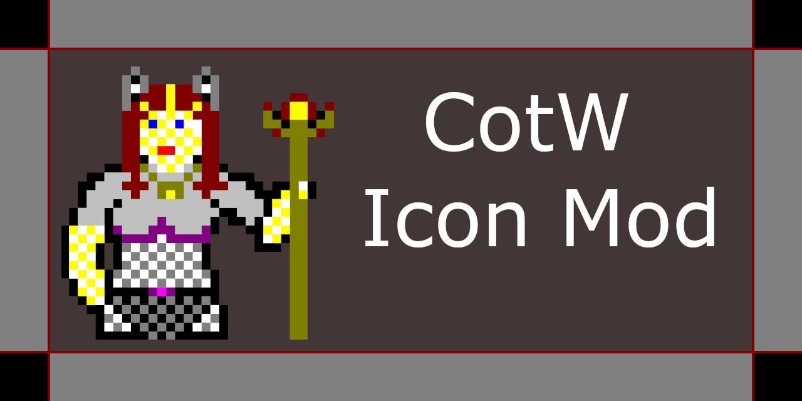

# Intro
This project's goal is to write a ICO editor to create custom player icons for the game "Castle of the Winds." I want this program to feel like it could have existed alongside the original game back in 1989 so I've chosen to do it as a 16-bit application for Windows 3.1.

There are straight icon editors available, but I wanted to make something more akin to how a character creator might look in a game. For example, the option to cycle through presets like what item the character is holding in their left hand.

In addition to the editor, I am writing a program that can patch the game executable with the custom player icon. This was done because trying to load the icon through the game's character menu often fails.

# Current status

The icon editor is able to do basic operations (single-pixel brush, rectangle, flood, erase, line, undo & redo) as well as open & save of both .ico and .bmp files.

The icon patching is working but I've mostly tested on Windows 3.1. It's able to run on my Windows 2000 VM but the colors are off - which may be due to the different display modes between Win2000 and my 3.1 setup.

